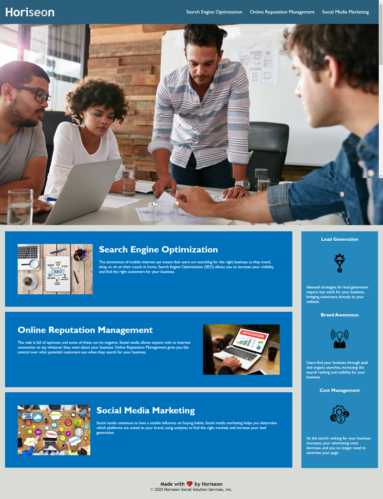

# Horiseon Code Refactor

This project is a refactor of a code from a marketing agency that wanted a codebase that follows accessibity standards. 

## Table of Contents
* [General Information](#general-information)
* [Installation](#installation)
* [Screenshot](#screenshot)
* [Credits](#credits)
* [License](#license)
## General Information

It is a known fact that accessible sites are not only important for search engine optimization, but also to provide equal access and equal opportunity for people with disabilities to participate more actively in society.

For a marketing agency an accessible website is an easy way to do business. It is estimated that approximately 10% of the world's popultion is living with a permanent or temporary disability that my exclude that from having access to information form websites. Also, conditional and situational disabilities for example, slow internet connection has to be considered as well.  

Below is a list of a few things that were done to make the wesite more accessible:
* Ensured that all internal links are working.
* The use of alt attribute in img tags.
* The use of semantic tags (header, nav, main, etc.) to replace div tags.

## Installation
A web browser is need to view page as it was made using HTML and CSS
* Github page
[https://nashwalters.github.io/horiseon-a11y-refactor/.](https://nashwalters.github.io/horiseon-a11y-refactor/.)

## Screenshot
Below is what the page should look like.

## Credits
* Carleton University Coding Bootcamp team
* [Adam Simonini](https://github.com/adamsimonini)
* [TanUv90-Youtube](https://www.youtube.com/watch?v=hHbWF1Bvgf4&t=5s)- How to link an image in Github readme.md

## License 
This code is licensed with [MIT License](https://github.com/nashwalters/horiseon-a11y-refactor/blob/main/LICENSE)

